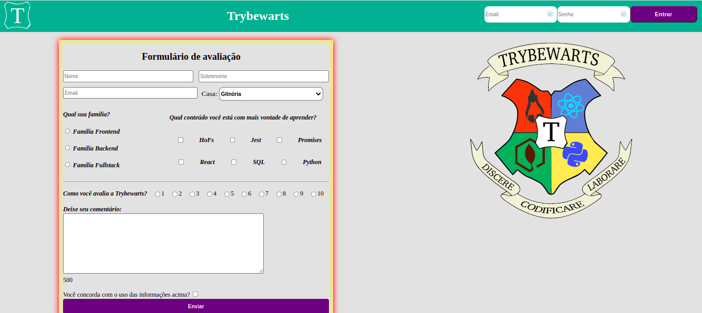

Este projeto em dupla foi desenvolvido por **Viviane Puga** e **Miguel Lima**, como parte do programa de estudos da **Trybe**

## Habilidades desenvolvidas

* Criamos formulários em HTML;
* Utilizamos CSS Flexbox para criar layouts flexíveis;
* Criamos regras CSS específicas para serem aplicadas a dispositivos móveis;
* Construir páginas que alteram o seu layout de acordo com a orientação da tela;

Neste projeto, desenvolvemos uma página de formulário da Escola de Magia de Trybewarts, em que as pessoas estudantes poderão enviar seus feedbacks sobre ela. O tema desse projeto é baseado na obra 'Harry Potter', de J. K. Rowling, já que programar é o mais próximo que podemos chegar de algo **verdadeiramente mágico**! 

Trabalhar nesse projeto com o Miguel foi incrível, trabalhamos em pair programming, aprendi muito com ele sobre estilização, a interação entre nós fluiu tranquila e respeitosamente. Adorei essa experiência!
